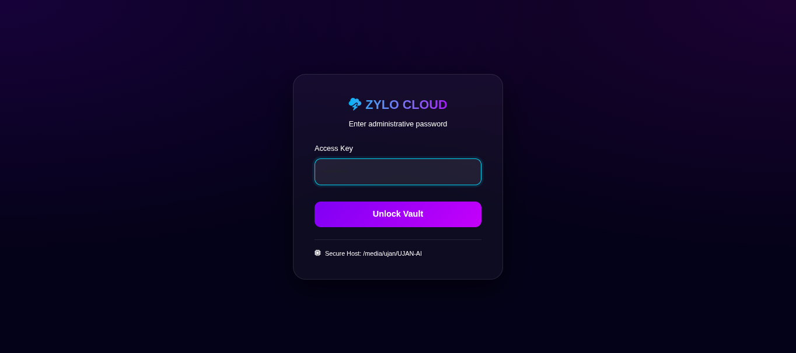
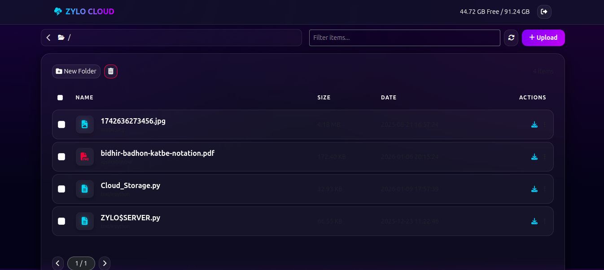
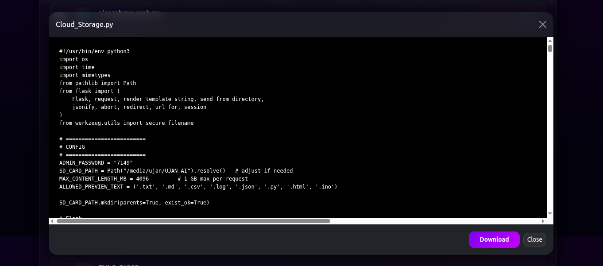
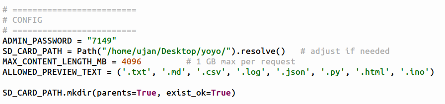

# ☁️ ZYLO-Cloud


[](https://github.com/UjanGuin/ZYLO-RiG0R/stargazers)


### Ultra-Premium Self-Hosted Own Cloud Storage System

ZYLO-Cloud is a **secure, high-performance, self-hosted cloud storage platform** built with Python and Flask, designed for **full ownership, privacy, and control** over your data.

Unlike traditional cloud services, **your files never leave your system**.
No third-party tracking. No hidden limits. No vendor lock-in.

This project delivers a **modern glassmorphism UI**, advanced file management, real-time uploads, previews, and administrative access — all running locally or over a secure tunnel.


<p align="center">
  
</p>
<p align="center">
  
</p>
<p align="center">
  
</p>

---

## 🚀 Key Highlights

* 🔐 **Password-Protected Admin Access**
* 🧊 **Ultra-Premium Glassmorphism UI**
* 📂 Full File & Folder Management

  * Upload (multi-file)
  * Download
  * Delete
  * Create folders
* 👁️ **Live File Preview**

  * Images
  * Videos
  * PDFs
  * Text & Code files
* ⚡ **Fast Chunked Uploads with Progress Tracking**
* 📱 **Fully Responsive (Mobile + Desktop)**
* 🧠 **Intelligent File Sorting & Search**
* 💾 **Real Storage Stats (Used / Free / Total)**
* 🛡️ **Path Traversal & Injection Protection**
* 🌐 **Ngrok-Ready for Secure Remote Access**


## 🎯 Why ZYLO-Cloud?

Most cloud platforms trade **convenience for control**.
ZYLO-Cloud flips that model.

You get:

* Absolute data ownership
* Local or private-network deployment
* Zero subscription cost
* No telemetry
* No dependency on Big Tech APIs

This is cloud storage **done right** — engineered, not outsourced.


## 🧩 Project Philosophy

> **Privacy is not a feature. It is a foundation.**

ZYLO-Cloud is built with:

* Explicit security boundaries
* Deterministic behavior
* Minimal external dependencies
* Production-grade structure, even for personal use

Intended for:

* Developers
* Students
* Makers
* Self-hosting enthusiasts
* Privacy-focused users


## 🏗️ Architecture Overview

ZYLO-Cloud follows a **clean, secure, server-driven architecture**:

* **Backend:** Python 3 + Flask
* **Frontend:** Server-rendered HTML + Bootstrap 5 + Vanilla JavaScript
* **Storage Layer:** Direct filesystem access (sandboxed to a defined root)
* **Security Layer:**

  * Session-based authentication
  * Strict path resolution (prevents traversal attacks)
  * Safe filename sanitization

All operations are performed **inside a controlled root directory**.


## ⚙️ Configuration (User-Changeable)

All critical parameters are configurable **from the top of `Cloud_Storage.py`**.


### 🔐 Admin Password

```python
ADMIN_PASSWORD = "7149"
```

* Controls access to the admin dashboard
* Must be changed **before any real deployment**
* Stored server-side only (no client exposure)


### 📂 Storage Root Directory

```python
SD_CARD_PATH = Path("/media/ujan/UJAN-AI/").resolve()
```

* Acts as the **sandboxed storage root**
* All uploads, downloads, and deletes are confined here
* Supports:

  * External HDD / SSD
  * USB drive
  * SD card
  * Internal folder

⚠️ Never point this to `/` or sensitive system directories.


<p align="center">
  
</p>

---


### 📦 Maximum Upload Size

```python
MAX_CONTENT_LENGTH_MB = 4096
```

* Controls per-request upload size
* Default: **4 GB**
* Adjust based on system RAM and disk throughput

---

## 🧠 Security Model

ZYLO-Cloud enforces **real security boundaries**:

* Session-based authentication
* Path traversal prevention
* Filesystem sandboxing
* Filename sanitization
* No shell execution
* No database attack surface
* No external cloud SDKs

All filesystem paths are validated before access.


## ▶️ Running the Server

### 1️⃣ Install dependencies

```bash
pip install flask
```

(Optional)

```bash
pip install -r requirements.txt
```

### 2️⃣ Start the server

```bash
python3 Cloud_Storage.py
```

### 3️⃣ Open in browser

```
http://localhost:50000
```


## 🌐 Remote Access (Ngrok)

To access the running server from anywhere from the world, beyond the wifi, one may use ngrok.
##### Follow these Steps:
- Login: https://dashboard.ngrok.com/login
- Copy the Authtoken: https://dashboard.ngrok.com/get-started/your-authtoken
- To download ngrok paste in terminal:
```bash
wget https://bin.equinox.io/c/bNyj1mQVY4c/ngrok-v3-stable-linux-amd64.tgz
```
```bash
tar -xvzf ngrok-v3-stable-linux-amd64.tgz
```
```bash
sudo mv ngrok /usr/local/bin
```
- To add the Authtoken, paste:
```bash
ngrok config add-authtoken $YOUR_AUTHTOKEN
```
(Replace $YOUR_AUTHTOKEN with the copied Authtoken.)
- Now paste:
```bash
ngrok http 50000
```
(50051 is the port. One can change it as wanted, but also ensure to change it in python code.)
<p align="center">
  
</p>

- After it, one will see output similar to:
```bash
Forwarding  https://xxxx-xxxx.ngrok-free.app -> http://localhost:50000
```
- Copy
```https://xxxx-xxxx.ngrok-free.app```
and paste at any browser to get started.

**Note:** The URL is not static.


## ⚠️ Production Notes

* Change the default admin password
* Set a strong Flask `SECRET_KEY`
* Use HTTPS when exposed publicly
* Do not run as root
* Restrict filesystem permissions


## 📜 License

MIT License

You are free to use, modify, and distribute this project.

---

## 🧠 Final Note

ZYLO-Cloud is not a clone.
It is a **statement**.

Your data. Your machine. Your rules.
